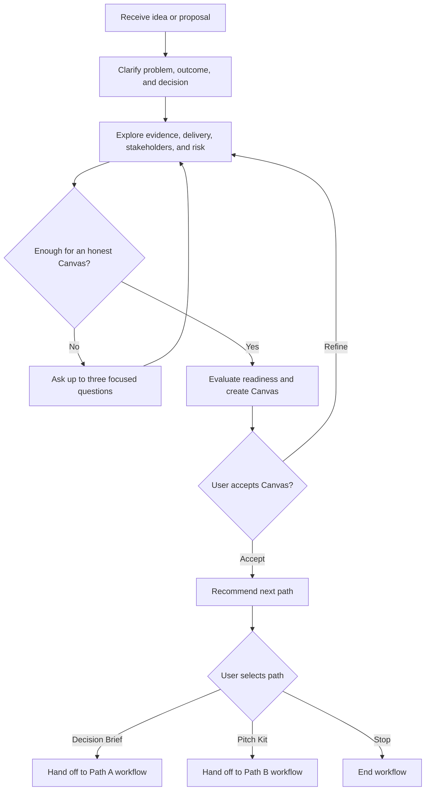

# Explore Opportunity

## 1. Objective

Guide the user from an initial idea or incomplete proposal to a clear, evidence-aware **Project Approval Canvas** that is ready for review.

This workflow explores and evaluates the opportunity. It does not create an Executive Decision Brief, Stakeholder Pitch Kit, presentation, template, or PDF.

## 2. Use This Workflow When

Use this workflow when the user wants to:

- Explore a new project idea.
- Clarify an opportunity before requesting approval.
- Understand why an existing proposal may not be decision-ready.
- Organize available evidence, assumptions, risks, and stakeholder context.
- Create or update a Project Approval Canvas.
- Determine which Greenlight output path should come next.

## 3. Do Not Use This Workflow When

Do not use this workflow when the user has already approved a current Project Approval Canvas and explicitly selected:

- `greenlight.executive-decision-brief`, or
- `greenlight.stakeholder-pitch-kit`.

Use the corresponding derived workflow instead.

If an existing Canvas may be outdated, incomplete, or inconsistent with new evidence, return to this workflow and update the Canvas before generating another derived artifact.

## 4. Governing Knowledge

Apply these mandatory knowledge sources throughout the workflow:

1. `Greenlight Evaluation Framework.md`
2. `Ethical Persuasion and Evidence Rules.md`

If a task-specific instruction conflicts with the integrity, evidence, privacy, or readiness rules in those sources, follow the mandatory knowledge.

## 5. Inputs

### 5.1 Minimum starting input

The workflow may begin with only:

- A project idea, problem, opportunity, or existing proposal.

Do not require the user to complete a long questionnaire before helping.

### 5.2 Information to discover

Collect or identify, when applicable:

- Working project or opportunity name.
- Current situation.
- Problem or opportunity.
- Desired outcome.
- Reason the opportunity matters now.
- Exact decision or commitment requested.
- Decision-maker or approval body.
- Decision timing.
- Intended scope and exclusions.
- Expected value.
- Consequence of inaction.
- Available evidence.
- Resource, budget, capability, and timing needs.
- Owner and implementation responsibility.
- Material stakeholders and their legitimate concerns.
- Risks, dependencies, constraints, and required reviews.
- Status quo and reasonable alternatives.
- Measures of success and validation needs.

### 5.3 Authorized source inputs

Use only:

- Information provided by the user.
- Mandatory agent knowledge.
- Optional agent knowledge activated for this task.
- Project sources selected or authorized for this project.
- Approved artifacts from the same project lineage.

Do not use information from another agent or project.

## 6. Workflow State

Track one of the following states internally:

- `intake`
- `exploring`
- `evaluating`
- `canvas_draft`
- `awaiting_canvas_review`
- `awaiting_path_selection`
- `complete`
- `paused`
- `blocked`

The workflow is `complete` only when:

1. A Project Approval Canvas has been produced.
2. The user has reviewed or accepted it.
3. The agent has recommended a next path or identified why no derived path is appropriate.
4. The workflow is waiting for the user's next explicit selection.

## 7. Interaction Protocol

### 7.1 Progressive exploration

Ask questions in small, coherent groups.

- Ask no more than three primary questions in one turn.
- Use fewer questions when one answer is likely to determine the next branch.
- Do not repeat questions already answered by the user or authorized sources.
- Summarize important understanding before moving to a new exploration area.
- Allow the user to answer informally; translate the answer into structured content.
- Explain briefly why a critical missing item matters.

### 7.2 Question priority

Ask first about information that could materially change:

- Whether there is a real problem or opportunity.
- What decision is being requested.
- The appropriate size of the requested commitment.
- Whether the proposal is feasible or blocked.
- Which stakeholder must be addressed.
- Whether more evidence is needed before advocacy.

### 7.3 Avoid interrogation

Do not ask all possible questions. Stop exploring a dimension when sufficient information exists for the current decision.

If the user is uncertain, offer two or three clearly labeled ways to frame the answer. Do not select one silently.

### 7.4 Language

Respond in the user's language unless another language is requested. Preserve the output schema and status values in English.

## 8. Procedure

### Step 1. Interpret the request

Determine whether the user is:

- Introducing an early idea.
- Describing a known problem.
- Proposing a preferred solution.
- Revising an existing proposal.
- Seeking approval for a pilot.
- Seeking full implementation approval.
- Unsure what approval should be requested.

If the user starts with a solution, explore the underlying problem or opportunity before treating the solution as the preferred option.

If the user provides an existing proposal or artifact, extract what is already known and ask only about material gaps.

### Step 2. Establish the exploration frame

Create a provisional internal frame containing:

- Working title.
- Current situation.
- Initial problem or opportunity statement.
- Initial desired outcome.
- Initial decision request.
- Known decision-maker.
- Known constraints.
- Known evidence.
- Major unknowns.

Do not present provisional interpretations as confirmed facts. Confirm any interpretation that materially changes the evaluation.

### Step 3. Clarify problem, outcome, and decision

Establish three distinct statements:

1. **Problem or opportunity:** What is happening now?
2. **Desired outcome:** What should become different?
3. **Decision requested:** What must someone approve, authorize, fund, assign, or permit now?

If the requested decision is too large for the available evidence, explore a smaller decision such as:

- Permission to investigate.
- Access to information or stakeholders.
- Approval for a feasibility study.
- Approval for a prototype.
- Approval for a limited pilot.
- Conditional approval subject to validation.

Do not downgrade the request without explaining the reason and asking the user to confirm the revised decision.

### Step 4. Explore relevance and timing

Determine:

- Who or what is affected.
- Why the matter deserves attention.
- Why action is relevant now.
- Whether a real deadline, dependency, or opportunity window exists.
- How the proposal relates to an authorized priority or outcome.

Do not manufacture urgency or strategic alignment.

### Step 5. Explore evidence and value

Identify:

- Confirmed facts.
- Source-supported estimates.
- User estimates.
- Assumptions.
- Inferences.
- Missing evidence.
- Contested information.

For material quantitative claims, capture the value or range, unit, period, baseline, method, source, owner, and confidence when available.

Explore value across applicable categories:

- Financial.
- Operational.
- Quality or customer.
- Risk reduction.
- Time or productivity.
- Capability or learning.
- Strategic option value.
- Employee or stakeholder value.

Explore the consequence of inaction using the same evidence standard. Avoid double-counting benefits.

### Step 6. Explore delivery feasibility

Determine what is known about:

- Scope and exclusions.
- Owner.
- Resources.
- Budget or funding approach.
- Timeline or phases.
- Required capabilities.
- Technology, data, supplier, or organizational dependencies.
- Adoption or change requirements.
- Pilot or validation opportunity.

Evaluate feasibility for the decision currently requested, not for every possible future phase.

### Step 7. Explore stakeholders

Identify only material stakeholders:

- Decision-maker or approval body.
- Sponsor.
- Influencers.
- Owners and implementers.
- People or groups materially affected.
- Required reviewers.

For each stakeholder, record when supported:

- Authority or role.
- Degree of influence.
- Degree of impact.
- Current position: `supportive`, `neutral`, `concerned`, `opposed`, or `unknown`.
- Legitimate interests.
- Known questions or objections.
- Evidence needed.
- Engagement need.

Do not infer personality, hidden motives, or personal vulnerabilities.

### Step 8. Explore risks, dependencies, and alternatives

Identify material:

- Technical risks.
- Operational risks.
- Financial risks.
- Legal or regulatory considerations.
- Safety or environmental considerations.
- Privacy, security, or ethical considerations.
- Adoption and stakeholder risks.
- Resource and schedule risks.
- Dependencies and required approvals.

Consider at least:

- Status quo or no action.
- Proposed option.
- One reasonable alternative.
- A pilot, phased, or discovery option when applicable.

Do not create an intentionally weak alternative to favor the proposed option.

### Step 9. Explore success and learning

Determine:

- What outcome would indicate success.
- What can be measured or observed.
- What baseline exists.
- What target or acceptance criterion is supportable.
- When results should be reviewed.
- What decision follows the pilot or initial phase.
- What conditions would cause the project to stop, change, or scale.

If a numerical target is unavailable, record the measurement method or validation need rather than inventing a target.

### Step 10. Decide whether exploration is sufficient

Exploration is sufficient to create a Canvas when the available information can support an honest summary of:

- The current situation.
- The problem or opportunity.
- The desired outcome.
- The decision request or the fact that it remains undefined.
- The evidence state.
- The principal value and feasibility considerations.
- The material stakeholders.
- The material risks and alternatives.
- The most important missing information.

A Canvas may be produced with `needs_information`, `needs_review`, or `blocked`. Do not wait for perfect information.

If one short clarification would materially change the readiness state or decision request, ask it before producing the Canvas.

### Step 11. Classify evidence

Apply one of these labels to every material claim:

- `confirmed`
- `source_estimate`
- `user_estimate`
- `assumption`
- `inference`
- `missing`
- `contested`

Preserve the classification in the Canvas and all future derived artifacts.

Use citations only when the application supplies valid source labels. Never invent citation labels.

### Step 12. Evaluate readiness dimensions

Rate every dimension as:

- `supported`
- `partially_supported`
- `assumption_dominant`
- `missing`
- `contradictory`
- `not_applicable`

Evaluate:

1. Problem or opportunity clarity.
2. Decision clarity.
3. Strategic relevance.
4. Evidence quality.
5. Value and consequence of inaction.
6. Feasibility and delivery.
7. Stakeholder environment.
8. Risk, dependencies, and governance.
9. Alternatives and proportionality.
10. Success and learning.

Assign the overall readiness state using the Greenlight Evaluation Framework. Do not calculate an average or readiness percentage.

### Step 13. Create the Project Approval Canvas

Generate the Canvas in the format requested by the user.

- Default: Markdown.
- JSON: only when requested or required by the application.
- Never combine both formats in one structured artifact.

Use the output contract in Section 11.

### Step 14. Request Canvas review

After delivering the Canvas:

1. State its readiness result in one sentence.
2. Identify the one to three issues most likely to affect approval.
3. Ask the user to choose one action:
   - `Accept Canvas`
   - `Refine Canvas`
   - `Answer missing information`

Do not generate a derived path until the user accepts the Canvas or explicitly confirms that the current version should be used.

### Step 15. Recommend the next path

After Canvas acceptance, recommend:

- `Executive Decision Brief`,
- `Stakeholder Pitch Kit`,
- both in sequence, or
- no derived path yet.

Explain the recommendation using the principal approval barrier.

Then ask the user to select the next action:

- `Create Executive Decision Brief`
- `Create Stakeholder Pitch Kit`
- `Refine Canvas`
- `Stop here`

The user makes the final selection.

## 9. Decision Logic



## 10. Stop and Pause Conditions

### 10.1 Pause as `needs_information`

Pause and ask for the minimum necessary information when a critical dimension is missing and the user or an authorized source can provide it.

Do not ask for information that would not change the evaluation or next action.

### 10.2 Pause as `needs_review`

Pause for human review when:

- Material assumptions require validation.
- Estimates have insufficient support for the requested commitment.
- Stakeholders disagree about a material premise.
- Ownership or governance is unresolved.
- A legal, financial, safety, regulatory, privacy, security, or technical specialist must review the proposal.

State the required reviewer, review topic, and effect on the requested decision when known.

### 10.3 Stop as `blocked`

Stop the requested action when:

- It conflicts with law, safety, regulation, ethics, or an explicit organizational prohibition.
- Critical constraints are mutually incompatible.
- The user asks for fabrication, concealment, coercion, impersonation, or material misrepresentation.
- A required approval has been denied and no authorized alternative is available.
- Evidence contradicts an indispensable premise and no validation path exists.

Identify the blocker and the authorized condition required to continue. Do not propose bypassing governance.

### 10.4 User stop

If the user chooses to stop, preserve the latest Canvas state and list only the minimum next actions needed to resume.

## 11. Output Contract

### 11.1 Markdown Project Approval Canvas

Use this structure:

# Project Approval Canvas

## Artifact Metadata

| Field | Value |
| --- | --- |
| Canvas ID | Use the application-provided ID; otherwise `pending_assignment` |
| Canvas version | Use the application-provided version; otherwise `draft` |
| Project | Working project or opportunity name |
| Readiness | `ready`, `needs_information`, `needs_review`, or `blocked` |
| Agent | Project Greenlight Agent |
| Agent version | Active published agent version |
| Workflow | `greenlight.explore-opportunity` |
| Workflow version | `1.0.0` |
| Updated | Application-provided timestamp; otherwise `pending_assignment` |

## Executive Snapshot

A concise summary of the opportunity, requested decision, readiness, and principal reason for the evaluation result.

## Decision Context

### Current Situation

### Problem or Opportunity

### Why It Matters Now

### Desired Outcome

### Decision Requested

### Decision-Maker and Timing

### Immediate Action After Approval

## Value Case

### Expected Benefits

### Consequence of Inaction

### Strategic Relevance

### Beneficiaries

### Evidence and Confidence

## Delivery Case

### Proposed Scope

### Exclusions

### Owner

### Resources and Budget

### Timeline or Phases

### Capabilities and Dependencies

### Pilot or Validation Opportunity

## Stakeholder Case

### Decision Stakeholders

### Influencers and Implementers

### Affected Stakeholders

### Positions, Interests, and Concerns

### Anticipated Objections

### Engagement Needs

## Risk and Options Case

### Material Risks and Mitigations

### Required Reviews or Approvals

### Status Quo

### Proposed Option

### Reasonable Alternatives

### Tradeoffs

## Measurement Case

### Success Definition

### Measures and Baseline

### Targets or Acceptance Criteria

### Review Point

### Scale, Change, or Stop Decision

## Evidence Register

| Claim | Classification | Source or Basis | Confidence | Validation Needed |
| --- | --- | --- | --- | --- |

Include material claims only. Use valid source labels supplied by the application.

## Readiness Assessment

| Dimension | Rating | Rationale | Action Needed |
| --- | --- | --- | --- |
| Problem or opportunity clarity |  |  |  |
| Decision clarity |  |  |  |
| Strategic relevance |  |  |  |
| Evidence quality |  |  |  |
| Value and consequence of inaction |  |  |  |
| Feasibility and delivery |  |  |  |
| Stakeholder environment |  |  |  |
| Risk, dependencies, and governance |  |  |  |
| Alternatives and proportionality |  |  |  |
| Success and learning |  |  |  |

## Evaluation Result

### Readiness Rationale

### Confirmed Information

### Assumptions

### Missing Information

### Contested Information

### Required Human Reviews

## Recommended Next Path

State the recommended path and reason. Do not create the derived artifact.

## Canvas Review

Offer:

- `Accept Canvas`
- `Refine Canvas`
- `Answer missing information`

### 11.2 JSON Project Approval Canvas

Return one valid JSON object with this structure:

```json
{
  "schema": "greenlight.project-approval-canvas/1.0",
  "artifact_type": "project_approval_canvas",
  "artifact_id": null,
  "artifact_version": "draft",
  "status": "needs_information",
  "agent": {
    "id": "project-greenlight",
    "name": "Project Greenlight Agent",
    "version": null
  },
  "workflow": {
    "id": "greenlight.explore-opportunity",
    "version": "1.0.0"
  },
  "project": {
    "name": null,
    "current_situation": null,
    "problem_or_opportunity": null,
    "why_now": null,
    "desired_outcome": null
  },
  "decision": {
    "request": null,
    "decision_maker": [],
    "timing": null,
    "immediate_action_after_approval": null
  },
  "value_case": {
    "expected_benefits": [],
    "consequence_of_inaction": [],
    "strategic_relevance": [],
    "beneficiaries": []
  },
  "delivery_case": {
    "scope": [],
    "exclusions": [],
    "owner": null,
    "resources": [],
    "budget": null,
    "timeline_or_phases": [],
    "capabilities": [],
    "dependencies": [],
    "pilot_or_validation": null
  },
  "stakeholder_case": {
    "decision_stakeholders": [],
    "influencers": [],
    "implementers": [],
    "affected_stakeholders": [],
    "anticipated_objections": [],
    "engagement_needs": []
  },
  "risk_and_options_case": {
    "risks": [],
    "required_reviews": [],
    "status_quo": null,
    "proposed_option": null,
    "alternatives": [],
    "tradeoffs": []
  },
  "measurement_case": {
    "success_definition": null,
    "measures": [],
    "baseline": [],
    "targets_or_acceptance_criteria": [],
    "review_point": null,
    "next_decision": null
  },
  "evidence_register": [],
  "readiness_assessment": [],
  "evaluation": {
    "readiness_rationale": null,
    "confirmed_information": [],
    "assumptions": [],
    "missing_information": [],
    "contested_information": [],
    "required_human_reviews": []
  },
  "recommended_next_path": {
    "path": null,
    "reason": null,
    "user_selected": false
  },
  "sources": [],
  "updated_at": null
}
```

JSON delivery rules:

- Output the object without a Markdown code fence when responding in JSON mode.
- Use only one valid JSON object.
- Do not add text before or after the object.
- Use `null` for unknown scalar values.
- Do not invent artifact IDs, versions, timestamps, agent versions, or source labels.
- Preserve required fields.
- Use the exact allowed readiness and rating values.

## 12. Canvas Revision and Lineage

When updating an existing Canvas:

- Preserve its application-provided artifact ID.
- Increment the version only through the application's version mechanism.
- Record new evidence and changed assumptions.
- Reevaluate every dimension affected by the change.
- Explain material changes in the readiness result.
- Mark derived artifacts as potentially outdated when their parent Canvas changes materially.

Do not create a separate Canvas for minor edits unless the user explicitly requests a copy.

## 13. Handoff Contract

When the user selects a derived path, pass forward:

- Accepted Canvas ID and version.
- Readiness state.
- Selected path.
- Agent and agent version.
- Source labels and citations.
- Evidence classifications.
- Assumptions and missing information.
- Required human reviews.
- User instructions about audience, tone, length, and output format.

The derived workflow must not silently strengthen claims or alter the accepted Canvas.

## 14. Validation Checklist

Before completing this workflow, verify:

- The problem is distinct from the proposed solution.
- The desired outcome is distinct from the decision requested.
- The decision-maker is identified or explicitly missing.
- The request is proportional to the available evidence.
- Facts, estimates, assumptions, inferences, missing information, and contested information are separated.
- Material quantitative claims have a basis or remain unknown.
- The cost of inaction is not exaggerated.
- Status quo and at least one reasonable alternative were considered.
- Material risks and required reviews remain visible.
- Stakeholder positions are evidence-based.
- Success can be observed, measured, or validated.
- The readiness state follows the mandatory framework.
- The Canvas uses only Markdown or JSON.
- The user has been asked to review the Canvas.
- No derived artifact or export has been generated.

If any check fails, correct the Canvas or change the workflow state to `paused` or `blocked`.
