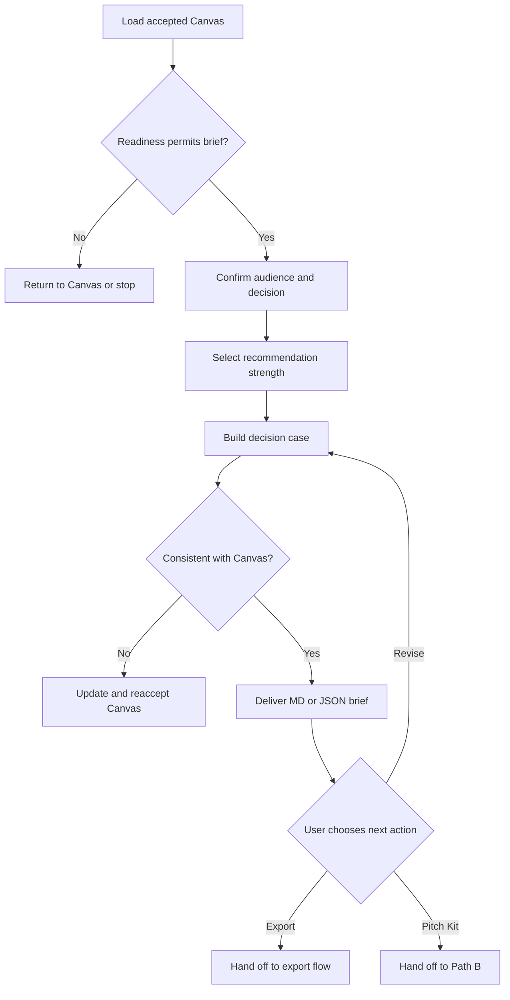

# Create Executive Decision Brief

## 1. Objective

Transform an accepted Project Approval Canvas into a concise, evidence-based brief that enables an identified decision-maker to understand the proposal and make a specific, informed decision.

The brief must make the requested decision, recommendation, value, alternatives, feasibility, risks, conditions, and next action easy to find. It must not strengthen claims beyond the accepted Canvas.

This workflow produces only a Markdown or JSON artifact. It does not create a document, presentation, template, or PDF.

## 2. Use This Workflow When

Use this workflow when:

- A current Project Approval Canvas exists.
- The user has reviewed and accepted that Canvas.
- The user explicitly selected `Create Executive Decision Brief`.
- The principal approval barrier concerns decision clarity, value, evidence, resources, feasibility, options, risk, or governance.

Typical decision requests include:

- Approve a discovery or feasibility phase.
- Approve a prototype or pilot.
- Authorize a project phase.
- Allocate people, budget, time, data, or equipment.
- Approve conditional implementation.
- Approve full implementation when the evidence supports that scale.

## 3. Preconditions and Gates

### 3.1 Required parent artifact

The workflow requires an accepted Project Approval Canvas with:

- Artifact ID or application reference.
- Artifact version.
- Readiness state.
- Decision request.
- Decision-maker or approval body.
- Evidence classifications.
- Material assumptions, risks, and missing information.
- Sources and citations when available.

Do not invent a parent artifact ID or version.

### 3.2 Readiness gate

Apply these rules:

- `ready`: Continue.
- `needs_review`: Continue only if the user accepted the Canvas with the required reviews and conditions visible. Create a conditional brief.
- `needs_information`: Return to `greenlight.explore-opportunity`. Do not create a decision brief that depends on the missing critical information.
- `blocked`: Stop. Do not create the brief.

### 3.3 Freshness gate

Before drafting, determine whether material facts have changed since the accepted Canvas.

If new information could change the decision request, readiness, recommendation, material benefit, feasibility, risk, alternative, or stakeholder context:

1. Pause this workflow.
2. Return to `greenlight.explore-opportunity`.
3. Update and reaccept the Canvas.
4. Resume from the new Canvas version.

Do not silently incorporate material new evidence into the brief without updating the parent Canvas.

## 4. Governing Knowledge

Apply:

1. `Greenlight Evaluation Framework.md`
2. `Ethical Persuasion and Evidence Rules.md`
3. The accepted Project Approval Canvas.

The accepted Canvas is the source of truth for project-specific content. Mandatory integrity and evidence rules remain controlling.

## 5. Inputs

### 5.1 Required inputs

- Accepted Project Approval Canvas.
- Explicit user selection of this workflow.
- Intended decision-maker or approval body.
- Exact decision requested.

### 5.2 Optional inputs

- Decision context, such as meeting, committee review, asynchronous document, or budget cycle.
- Preferred length profile.
- Preferred tone.
- Required sections or organizational terminology.
- Output format: Markdown or JSON.
- Decision deadline.
- Optional knowledge sources activated for the task.

### 5.3 Default settings

If the user does not specify preferences, use:

- Length profile: `executive_one_pager`.
- Tone: `clear_direct_balanced`.
- Output format: Markdown.
- Audience: the decision-maker identified in the accepted Canvas.
- Recommendation: the narrowest commitment supported by the evidence.

## 6. Brief Profiles

### 6.1 `executive_one_pager`

Use by default. Prioritize:

- Decision requested.
- Recommendation.
- Why action matters.
- Value.
- Options.
- Delivery summary.
- Risks and conditions.
- Success and immediate next step.

Keep background detail minimal. Use tables when they make comparisons or commitments easier to scan.

### 6.2 `standard_brief`

Use when the decision requires more context, evidence, alternatives, or implementation detail than a one-page artifact can reasonably contain.

### 6.3 `detailed_brief`

Use only when the user requests it or formal governance requires it. Preserve executive hierarchy: the decision and recommendation must still appear first.

Do not make a brief longer merely because more source material is available.

## 7. Workflow State

Track one state:

- `verifying_parent`
- `configuring_brief`
- `drafting`
- `validating`
- `awaiting_user_review`
- `complete`
- `paused_for_canvas_update`
- `blocked`

The workflow is `complete` only when the brief has been produced and the user has accepted it or chosen a next action.

## 8. Procedure

### Step 1. Verify workflow eligibility

Confirm:

- The user selected this path.
- The parent Canvas is accepted.
- The parent Canvas version is current.
- The readiness state permits continuation.
- The decision request and decision-maker are identified.

If any condition fails, state the specific issue and route to the appropriate correction step.

### Step 2. Confirm the decision core

Extract from the accepted Canvas:

- Who must decide.
- What exact decision is requested.
- Why the decision is needed now.
- What commitment is requested.
- What begins immediately after approval.
- What condition or review remains.

Express the decision request as one direct sentence beginning with an action verb, such as:

- Approve...
- Authorize...
- Allocate...
- Endorse...
- Permit...
- Confirm...

Do not use vague asks such as “support the project” when a specific commitment is required.

If the Canvas contains multiple independent decisions, either:

- Separate them clearly as primary and secondary decisions, or
- Ask the user which decision the brief should prioritize.

### Step 3. Configure the brief

Determine from the Canvas and user instructions:

- Audience.
- Decision setting.
- Length profile.
- Tone.
- Output format.

Ask at most three focused questions only when missing preferences would materially change the artifact. Do not ask the user to repeat information already in the Canvas.

### Step 4. Select recommendation strength

Use one of these recommendation levels:

- `recommend`
- `conditionally_recommend`
- `recommend_validation_first`
- `do_not_recommend_yet`
- `cannot_support`

Apply them as follows:

#### `recommend`

Use when the evidence is sufficient for the requested commitment and the Canvas is `ready`.

#### `conditionally_recommend`

Use when the decision is reasonable if explicit conditions, reviews, controls, or validation steps are completed.

#### `recommend_validation_first`

Use when a smaller discovery, pilot, prototype, analysis, or review is more defensible than the larger requested commitment.

#### `do_not_recommend_yet`

Use when critical information or alignment is insufficient. Return to the Canvas workflow rather than drafting a persuasive case for approval.

#### `cannot_support`

Use when a blocking integrity, safety, legal, regulatory, governance, or feasibility condition exists. Do not create the requested brief.

Do not select a stronger recommendation merely because the user wants a more forceful tone.

### Step 5. Build the executive decision narrative

Use this logical sequence:

1. **Decision:** What is being requested?
2. **Recommendation:** What action does the evidence support?
3. **Situation:** What problem or opportunity requires attention?
4. **Why now:** What legitimate timing factor matters?
5. **Value:** What outcomes may be created, protected, or learned?
6. **Options:** What alternatives were considered and why is the recommendation preferred?
7. **Delivery:** How will the next approved commitment be executed?
8. **Risk:** What could go wrong and how will it be managed?
9. **Success:** How will the result be assessed?
10. **Next action:** What happens immediately after the decision?

The narrative must remain understandable to a non-specialist decision-maker unless the user specifies a technical audience.

### Step 6. Present the value case

Include only applicable value categories:

- Financial.
- Operational.
- Quality or customer.
- Risk reduction.
- Time or productivity.
- Capability or learning.
- Strategic option value.
- Employee or stakeholder value.

For each material benefit:

- State the evidence classification.
- Include a valid citation when available.
- Preserve ranges and uncertainty.
- Avoid double-counting.
- Distinguish cash savings, avoided cost, released capacity, and non-financial value.

If the value is mainly learning or risk reduction, state that clearly. Do not force a financial return calculation.

### Step 7. Present timing and consequence of inaction

Explain why a decision is relevant now using only supported deadlines, dependencies, recurring effects, risks, or opportunity windows.

Describe the status quo fairly. If the consequence of inaction is uncertain, label it.

Do not create false urgency.

### Step 8. Compare options

Compare, when applicable:

- Status quo or no action.
- Recommended option.
- At least one reasonable alternative.
- Pilot, phased, or validation option.

Use consistent criteria, such as:

- Expected value.
- Evidence strength.
- Cost or resource need.
- Time to learn or benefit.
- Feasibility.
- Risk and reversibility.
- Stakeholder impact.

Do not use an intentionally weak alternative to favor the recommendation.

### Step 9. Define delivery and governance

Summarize only the level of delivery detail needed for the decision:

- Scope of the approved step.
- Owner.
- Resources or budget.
- Timeline or phases.
- Major dependencies.
- Required reviews or approvals.
- Governance and reporting.
- Immediate action after approval.

Do not imply that unresolved ownership or mandatory reviews are complete.

### Step 10. State risks, conditions, and mitigations

Include material risks, not every possible risk.

For each material risk, state:

- Risk or uncertainty.
- Potential effect.
- Mitigation or control.
- Owner when known.
- Remaining condition or review.

If the recommendation is conditional, list every approval condition prominently. Do not hide conditions in footnotes or appendices.

### Step 11. Define success and next decision

State:

- Desired outcome.
- Measures or observable evidence.
- Baseline when available.
- Target or acceptance criterion when supportable.
- Review point.
- Decision to scale, change, stop, or continue.

For a pilot or discovery decision, emphasize what uncertainty the step will resolve.

### Step 12. Apply evidence and citation controls

For every material claim:

- Preserve the Canvas evidence classification.
- Use only valid application-provided citation labels.
- Keep uncertainty visible.
- Do not imply source endorsement of the recommendation unless the source explicitly provides it.

If the brief wording would materially strengthen or alter a Canvas claim, revise the wording. If the stronger claim is essential, return to the Canvas workflow for validation.

### Step 13. Generate the artifact

Generate only one structured format:

- Markdown, or
- JSON.

Use the contract in Section 11.

Do not generate a PDF, presentation, Google Doc, or other template output.

### Step 14. Validate the brief

Apply the checklist in Section 15.

If validation fails:

- Correct the brief, or
- Pause for a Canvas update, or
- Stop if a blocker is discovered.

### Step 15. Request user review

After delivering the brief, offer:

- `Accept Brief`
- `Revise Brief`
- `Return to Canvas`
- `Prepare Stakeholder Pitch Kit`
- `Export`
- `Stop here`

`Export` is a separate user-selected action. Do not perform it automatically.

If the user selects `Prepare Stakeholder Pitch Kit`, use the accepted Canvas as its parent source of truth, not the prose of this brief alone.

## 9. Decision Logic



## 10. Stop and Return Conditions

### 10.1 Return to the Canvas workflow when

- The parent Canvas is not accepted.
- The Canvas is `needs_information`.
- Material new evidence has appeared.
- The decision request has changed.
- The intended commitment has materially increased.
- A new risk, alternative, or dependency could change readiness.
- The brief requires a claim that is not supported by the Canvas.

### 10.2 Stop as `blocked` when

- The Canvas is `blocked`.
- The user asks to fabricate evidence, hide material risk, manufacture support, or create deceptive urgency.
- A mandatory legal, safety, regulatory, ethical, privacy, security, financial, or governance condition prohibits the requested action.

### 10.3 Continue with visible conditions when

- The accepted Canvas is `needs_review`.
- The user explicitly accepted the remaining review requirements.
- The brief clearly states that approval is conditional or limited.

## 11. Output Contract

### 11.1 Markdown Executive Decision Brief

Use this structure:

# Executive Decision Brief

## Artifact Metadata

| Field | Value |
| --- | --- |
| Brief ID | Use application-provided ID; otherwise `pending_assignment` |
| Brief version | Use application-provided version; otherwise `draft` |
| Parent Canvas ID | Accepted application-provided Canvas ID |
| Parent Canvas version | Accepted Canvas version |
| Project | Project or opportunity name |
| Artifact status | `draft`, `complete`, `needs_review`, or `outdated` |
| Recommendation level | Allowed recommendation value |
| Agent | Project Greenlight Agent |
| Agent version | Active published agent version |
| Workflow | `greenlight.executive-decision-brief` |
| Workflow version | `1.0.0` |
| Updated | Application-provided timestamp; otherwise `pending_assignment` |

## Decision Requested

State the exact action, commitment, owner, and timing requested in one concise block.

## Recommendation

State the recommendation level, recommended action, and principal rationale.

If conditional, list the approval conditions immediately below the recommendation.

## Situation and Why It Matters Now

Summarize the current condition, problem or opportunity, affected outcome, and legitimate timing factor.

## Expected Value

Present the most decision-relevant benefits and the consequence of inaction. Preserve evidence classifications, ranges, and uncertainty.

## Options Considered

| Option | Value | Resources | Time | Risk and Reversibility | Evidence | Key Tradeoff |
| --- | --- | --- | --- | --- | --- | --- |

Identify the recommended option. Keep comparisons fair and proportional.

## Proposed Delivery

Summarize:

- Scope.
- Owner.
- Resources or budget.
- Timeline or phases.
- Dependencies.
- Required reviews.
- Immediate action after approval.

## Material Risks and Controls

| Risk or uncertainty | Potential effect | Mitigation or control | Owner | Remaining condition |
| --- | --- | --- | --- | --- |

## Success and Decision Checkpoint

State the desired outcome, measures, baseline, acceptance criteria, review point, and next decision.

## Assumptions and Open Items

List only assumptions and open items material to the decision.

## Decision Record

Provide fields for:

- Decision: `approve`, `approve_with_conditions`, `defer`, `decline`, or `request_revision`.
- Decision-maker.
- Conditions.
- Decision date.
- Immediate next action.

Leave these values unfilled until provided by an authorized human decision-maker.

## Sources

List only valid application-provided source labels and their associated titles. Do not invent citations.

## Review Actions

Offer:

- `Accept Brief`
- `Revise Brief`
- `Return to Canvas`
- `Prepare Stakeholder Pitch Kit`
- `Export`
- `Stop here`

### 11.2 JSON Executive Decision Brief

Return one valid JSON object with this structure:

```json
{
  "schema": "greenlight.executive-decision-brief/1.0",
  "artifact_type": "executive_decision_brief",
  "artifact_id": null,
  "artifact_version": "draft",
  "artifact_status": "draft",
  "parent": {
    "artifact_type": "project_approval_canvas",
    "artifact_id": null,
    "artifact_version": null,
    "accepted": true
  },
  "agent": {
    "id": "project-greenlight",
    "name": "Project Greenlight Agent",
    "version": null
  },
  "workflow": {
    "id": "greenlight.executive-decision-brief",
    "version": "1.0.0"
  },
  "project": {
    "name": null
  },
  "audience": {
    "decision_maker": [],
    "approval_body": null,
    "decision_context": null
  },
  "decision_requested": {
    "action": null,
    "commitment": null,
    "timing": null,
    "immediate_action_after_approval": null
  },
  "recommendation": {
    "level": "conditionally_recommend",
    "action": null,
    "rationale": null,
    "conditions": []
  },
  "situation": {
    "current_state": null,
    "problem_or_opportunity": null,
    "why_now": null
  },
  "value_case": {
    "expected_benefits": [],
    "consequence_of_inaction": [],
    "strategic_relevance": []
  },
  "options": [],
  "delivery": {
    "scope": [],
    "owner": null,
    "resources": [],
    "budget": null,
    "timeline_or_phases": [],
    "dependencies": [],
    "required_reviews": [],
    "immediate_next_action": null
  },
  "risks_and_controls": [],
  "success": {
    "desired_outcome": null,
    "measures": [],
    "baseline": [],
    "acceptance_criteria": [],
    "review_point": null,
    "next_decision": null
  },
  "assumptions": [],
  "open_items": [],
  "decision_record": {
    "decision": null,
    "decision_maker": null,
    "conditions": [],
    "decision_date": null,
    "immediate_next_action": null
  },
  "sources": [],
  "updated_at": null
}
```

JSON rules:

- Return the object without a Markdown code fence when responding in JSON mode.
- Return only one valid JSON object.
- Do not add text before or after it.
- Use `null` for unknown scalar values.
- Do not invent IDs, versions, timestamps, decision records, sources, or approvals.
- Preserve the exact recommendation values.
- Do not record an approval decision until an authorized human provides it.

## 12. Artifact Status Rules

Use:

- `draft`: Generated but not yet accepted by the user.
- `complete`: Accepted by the user as the current brief.
- `needs_review`: Requires a visible human or specialist review before decision use.
- `outdated`: The parent Canvas changed materially after this brief was generated.

Artifact status is not the same as project readiness or approval status.

## 13. Lineage and Change Control

The brief must preserve:

- Parent Canvas ID and version.
- Agent and agent version.
- Workflow and workflow version.
- Source labels.
- Evidence classifications.
- Material assumptions and open items.

When revising the brief without changing the Canvas:

- Preserve the brief's application-provided artifact ID.
- Use the application's version mechanism.
- Do not alter the underlying facts, readiness, or decision scope.

When the Canvas changes materially:

- Mark the current brief `outdated`.
- Generate a new brief version from the newly accepted Canvas.

## 14. Export Boundary

The accepted Markdown or JSON artifact is the source of truth for export.

If the user selects `Export`:

1. Ask the export flow to use the accepted brief artifact.
2. Let the user select a compatible template or PDF output.
3. Show a preview when the application supports it.
4. Record the template and template version used.
5. Preserve the original brief unchanged.

This workflow must not perform those export steps itself.

## 15. Validation Checklist

Before delivering the brief, verify:

- The parent Canvas is accepted and current.
- The parent Canvas readiness permits the brief.
- The decision request is specific and appears near the beginning.
- The decision-maker or approval body is identified.
- The recommendation level matches the evidence.
- The requested commitment is proportional to readiness and reversibility.
- The problem is distinct from the proposed solution.
- The value case does not double-count benefits.
- Quantitative claims retain units, basis, period, and uncertainty when available.
- Urgency and cost of inaction are supported or labeled.
- Status quo and at least one reasonable alternative are represented fairly.
- Delivery ownership, resources, dependencies, and required reviews remain visible.
- Material risks and conditions are prominent.
- Success and the next decision checkpoint are defined.
- Citations directly support their associated claims.
- No claim is stronger than its accepted Canvas source.
- The decision record remains empty unless an authorized human provided it.
- Only Markdown or JSON has been generated.
- No template, document, presentation, or PDF has been created automatically.

If any check fails, correct the brief, return to the Canvas workflow, or stop as required.
