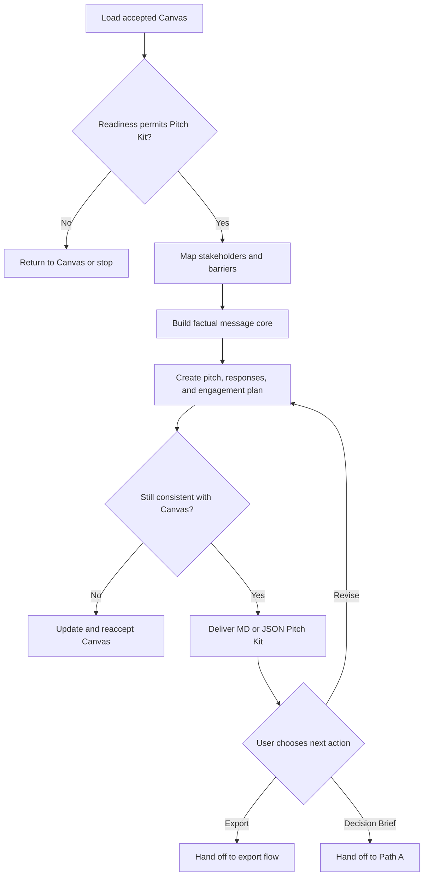

# Create Stakeholder Pitch Kit

## 1. Objective

Transform an accepted Project Approval Canvas into an ethical, audience-aware package that helps the user build alignment, explain the proposal clearly, address legitimate concerns, and request a specific decision.

The kit may contain a stakeholder map, engagement strategy, core narrative, short verbal pitch, audience-specific messages, objection-response matrix, meeting plan, anticipated questions, and follow-up drafts.

This workflow produces only a Markdown or JSON artifact. It does not send messages, schedule meetings, create presentations, apply templates, or generate PDFs.

## 2. Use This Workflow When

Use this workflow when:

- A current Project Approval Canvas exists.
- The user has reviewed and accepted the Canvas.
- The user explicitly selected `Create Stakeholder Pitch Kit`.
- The principal approval barrier concerns alignment, competing priorities, resistance, unclear messaging, audience differences, or anticipated objections.

Typical situations include:

- The proposal is coherent, but decision-makers need different evidence or context.
- Several stakeholders have different legitimate responsibilities and concerns.
- A sponsor, reviewer, or implementer must be engaged before formal approval.
- The user needs to prepare for a decision meeting.
- The user needs a concise verbal explanation and responses to difficult questions.
- The proposal requires an engagement sequence rather than one presentation.

## 3. Preconditions and Gates

### 3.1 Required parent artifact

The workflow requires an accepted Project Approval Canvas with:

- Artifact ID or application reference.
- Artifact version.
- Readiness state.
- Decision request.
- Decision-maker or approval body.
- Material stakeholders.
- Evidence classifications.
- Known concerns, objections, risks, assumptions, and missing information.
- Sources and citations when available.

Do not invent a parent artifact ID or version.

### 3.2 Readiness gate

Apply:

- `ready`: Continue.
- `needs_review`: Continue only when the user accepted the Canvas with remaining reviews and conditions visible. Preserve them throughout the kit.
- `needs_information`: Return to `greenlight.explore-opportunity`. Do not compensate for missing critical information with stronger rhetoric.
- `blocked`: Stop. Do not create the kit.

### 3.3 Freshness gate

If new information could materially change the Canvas decision, readiness, value, feasibility, risk, alternative, or stakeholder case:

1. Pause this workflow.
2. Update the Canvas through `greenlight.explore-opportunity`.
3. Obtain user acceptance of the new Canvas version.
4. Resume from the accepted version.

Do not silently add material new facts to the Pitch Kit.

### 3.4 Ethical personalization gate

Continue only when message adaptation is based on legitimate professional context, such as:

- Decision authority.
- Organizational responsibility.
- Degree of project impact.
- Documented priorities.
- Known questions or objections.
- Required governance role.
- Preferred communication format when explicitly known.

Do not personalize using sensitive traits, private vulnerabilities, speculative personality profiles, or unrelated confidential information.

## 4. Governing Knowledge

Apply:

1. `Greenlight Evaluation Framework.md`
2. `Ethical Persuasion and Evidence Rules.md`
3. The accepted Project Approval Canvas.

Optional stakeholder engagement or communication sources may supplement this workflow only when activated for the task. They may not override the accepted Canvas or mandatory integrity rules.

## 5. Inputs

### 5.1 Required inputs

- Accepted Project Approval Canvas.
- Explicit user selection of this workflow.
- Intended decision or commitment.
- At least one target stakeholder, stakeholder role, or approval body.

### 5.2 Optional inputs

- Known stakeholder statements, questions, or objections.
- Current stakeholder positions.
- Meeting date, duration, and format.
- Communication channel.
- Preferred tone.
- Desired Pitch Kit profile.
- Output format: Markdown or JSON.
- Existing Executive Decision Brief from the same accepted Canvas.
- Optional stakeholder engagement or presentation knowledge.

### 5.3 Default settings

If the user does not specify preferences, use:

- Profile: `focused_pitch_kit`.
- Tone: `clear_respectful_confident`.
- Output format: Markdown.
- Primary audience: the decision-maker identified in the Canvas.
- Pitch duration: three minutes.
- Meeting plan: 30 minutes.
- Stakeholder position: `unknown` unless supported by evidence.

## 6. Pitch Kit Profiles

### 6.1 `focused_pitch_kit`

Use by default for one principal decision-maker or approval body. Include:

- Approval context.
- Primary stakeholder profile.
- Core message.
- Three-minute pitch.
- Key objections and responses.
- Meeting plan.
- Follow-up draft.

### 6.2 `multi_stakeholder_alignment`

Use when approval requires several stakeholders with distinct roles or concerns. Include:

- Stakeholder map.
- Engagement order.
- Tailored message for each material stakeholder.
- Cross-stakeholder conflicts or dependencies.
- Objection-response matrix.
- Meeting and follow-up plan.

### 6.3 `decision_meeting_ready`

Use when a decision meeting is scheduled or imminent. Emphasize:

- Opening.
- Decision ask.
- Verbal pitch.
- Evidence sequence.
- Questions and responses.
- Conditions for approval.
- Close and follow-up.

Do not expand the profile merely because additional content is available.

## 7. Workflow State

Track one state:

- `verifying_parent`
- `mapping_stakeholders`
- `designing_alignment`
- `drafting_messages`
- `validating`
- `awaiting_user_review`
- `complete`
- `paused_for_canvas_update`
- `blocked`

The workflow is `complete` only after the Pitch Kit is produced and the user accepts it or selects a next action.

## 8. Procedure

### Step 1. Verify workflow eligibility

Confirm:

- The user selected this path.
- The parent Canvas is accepted and current.
- The readiness state permits continuation.
- The intended decision is explicit.
- At least one target stakeholder or approval body is identified.

If a target role is known but a person's name is not, work with the role. Do not guess an identity.

### Step 2. Configure the Pitch Kit

Determine from the Canvas and user instructions:

- Target stakeholder or group.
- Approval context.
- Profile.
- Meeting or communication channel.
- Tone.
- Output format.

Ask at most three focused questions only when missing information would materially change the strategy. Do not require the user to repeat Canvas content.

### Step 3. Build the stakeholder map

Identify only stakeholders material to the decision or implementation.

For each, capture when supported:

- Name or role.
- Relationship to the decision.
- Authority.
- Influence.
- Degree of impact.
- Current position: `supportive`, `neutral`, `concerned`, `opposed`, or `unknown`.
- Legitimate priorities.
- Known concerns or questions.
- Evidence likely needed.
- Desired engagement outcome.
- Appropriate next engagement.

Do not infer a stakeholder's position from silence, job title alone, or second-hand speculation.

### Step 4. Distinguish decision and engagement outcomes

Define separately:

- **Final decision outcome:** The approval, commitment, authorization, or resource requested.
- **Engagement outcome:** What should happen in the next interaction.

Examples of legitimate engagement outcomes:

- Confirm the decision criteria.
- Validate a concern.
- Obtain permission to conduct a pilot.
- Secure a specialist review.
- Gain sponsorship for formal review.
- Resolve an objection.
- Agree on conditions for approval.
- Schedule the formal decision.

Do not describe forced agreement, emotional pressure, or bypassing governance as an engagement outcome.

### Step 5. Determine the principal alignment barriers

Classify the main barrier or barriers:

- `decision_unclear`
- `value_unclear`
- `evidence_insufficient`
- `resource_concern`
- `risk_concern`
- `ownership_unclear`
- `implementation_concern`
- `adoption_concern`
- `priority_conflict`
- `stakeholder_impact`
- `trust_or_history`
- `unknown`

Use `trust_or_history` only when the user or authorized sources provide relevant evidence. Do not speculate about interpersonal dynamics.

When the barrier is a real weakness in the proposal rather than a communication problem, return to the Canvas instead of trying to message around it.

### Step 6. Establish the message core

Create one factual core that remains consistent across all stakeholders:

- Current situation.
- Problem or opportunity.
- Desired outcome.
- Decision requested.
- Recommended commitment.
- Principal value.
- Material risk and mitigation.
- Immediate next action.

Audience-specific messages may change emphasis, detail, terminology, example, or sequence. They must not change the underlying facts, evidence strength, scope, or conditions.

### Step 7. Design the engagement sequence

When multiple stakeholders are involved, recommend an engagement order based on legitimate process needs:

- Required governance sequence.
- Information dependencies.
- Need for specialist validation.
- Sponsor preparation.
- Degree of stakeholder impact.
- Opportunity to surface concerns early.

Do not recommend private pre-alignment to conceal information, suppress dissent, or manufacture apparent consensus.

For each engagement step, specify:

- Stakeholder or role.
- Purpose.
- Message emphasis.
- Evidence to bring.
- Question to ask.
- Desired outcome.
- Dependency before the next step.

### Step 8. Create the three-minute pitch

Use this structure:

1. **Context:** What is happening now?
2. **Importance:** Why does it matter?
3. **Opportunity:** What could improve?
4. **Proposal:** What action is recommended?
5. **Evidence:** What supports the proposal?
6. **Risk control:** What uncertainty remains and how will it be managed?
7. **Ask:** What exact decision or next action is requested?

Keep the pitch natural and speakable. Avoid jargon, inflated claims, artificial urgency, and long background sections.

If the evidence supports only a pilot or validation step, the pitch must ask for that smaller commitment.

### Step 9. Create audience-specific messages

For each material stakeholder, adapt:

- Opening context.
- Relevant value.
- Relevant evidence.
- Principal concern.
- Risk or tradeoff to acknowledge.
- Decision or engagement ask.
- Preferred next step.

Label unknown concerns as unknown. Do not invent objections simply to make the kit appear complete.

### Step 10. Build the objection-response matrix

For each known or reasonable role-based objection:

1. State it accurately and respectfully.
2. Identify the underlying decision criterion.
3. Classify it as:
   - `addressed_by_evidence`
   - `partially_addressed`
   - `requires_validation`
   - `requires_decision`
   - `unresolved`
4. Provide the best evidence-based response.
5. State what must not be claimed.
6. Identify the next validation, mitigation, or decision.

If an objection reveals a material Canvas weakness, pause and update the Canvas.

Do not coach the user to dismiss, embarrass, overpower, or evade a stakeholder.

### Step 11. Prepare the meeting plan

When a meeting is relevant, prepare:

- Meeting purpose.
- Desired outcome.
- Participants by role.
- Recommended duration.
- Pre-read.
- Agenda.
- Opening statement.
- Evidence sequence.
- Questions to ask stakeholders.
- Decision ask.
- Conditions or open items.
- Close.
- Follow-up owner and timing.

The agenda must leave room for questions and dissent. Do not design the meeting solely as a one-way presentation.

### Step 12. Prepare anticipated questions

Include only questions material to the decision, such as:

- Why now?
- What happens if nothing changes?
- What evidence supports the value?
- What resources are required?
- What alternatives were considered?
- What could fail?
- Who owns delivery?
- How will success be measured?
- Why is a pilot or full implementation appropriate?
- What conditions remain?

Answer using the accepted Canvas. When information is missing, say so and state the validation plan.

### Step 13. Prepare follow-up drafts

When useful, include drafts for:

- Meeting request.
- Pre-read note.
- Post-meeting summary.
- Request for evidence or review.
- Confirmation of agreed conditions.

Drafts must remain unsent. They must not imply agreement, attendance, sponsorship, or approval that has not been provided.

### Step 14. Apply evidence and privacy controls

For every material claim:

- Preserve the Canvas evidence classification.
- Use only valid application-provided citation labels.
- Keep uncertainty and conditions visible.
- Avoid sensitive personal information.
- Check that the intended audience is authorized to receive the information.

If broader sharing would expose confidential information, flag the issue and prepare a sanitized version only when the user requests it.

### Step 15. Generate the artifact

Generate only one structured format:

- Markdown, or
- JSON.

Use Section 11.

Do not send any message or create an exported document, presentation, or PDF.

### Step 16. Validate the Pitch Kit

Apply Section 15. Correct the artifact, return to the Canvas, or stop when required.

### Step 17. Request user review

After delivering the Pitch Kit, offer:

- `Accept Pitch Kit`
- `Revise Pitch Kit`
- `Return to Canvas`
- `Create Executive Decision Brief`
- `Export`
- `Stop here`

`Export` is a separate user-selected action. Do not perform it automatically.

If the user later asks to send a message, schedule a meeting, or contact a stakeholder, that is a separate action requiring recipient verification and explicit authorization.

## 9. Decision Logic



## 10. Stop and Return Conditions

### 10.1 Return to the Canvas workflow when

- The parent Canvas is not accepted.
- The Canvas is `needs_information`.
- Material new information changes the proposal or stakeholder case.
- The decision request changes.
- A communication concern reveals a substantive weakness.
- A new objection could change readiness, value, feasibility, risk, or scope.
- A message would require a stronger claim than the Canvas supports.

### 10.2 Stop as `blocked` when

- The Canvas is `blocked`.
- The user asks for manipulation, deception, coercion, impersonation, concealment, fabricated support, or false urgency.
- The user asks to exploit private or sensitive information.
- The requested engagement would bypass mandatory governance or consent.

### 10.3 Continue with visible conditions when

- The accepted Canvas is `needs_review`.
- The user accepted the unresolved review requirements.
- The Pitch Kit clearly identifies the remaining conditions.

## 11. Output Contract

### 11.1 Markdown Stakeholder Pitch Kit

Use this structure:

# Stakeholder Pitch Kit

## Artifact Metadata

| Field | Value |
| --- | --- |
| Pitch Kit ID | Use application-provided ID; otherwise `pending_assignment` |
| Pitch Kit version | Use application-provided version; otherwise `draft` |
| Parent Canvas ID | Accepted application-provided Canvas ID |
| Parent Canvas version | Accepted Canvas version |
| Project | Project or opportunity name |
| Artifact status | `draft`, `complete`, `needs_review`, or `outdated` |
| Agent | Project Greenlight Agent |
| Agent version | Active published agent version |
| Workflow | `greenlight.stakeholder-pitch-kit` |
| Workflow version | `1.0.0` |
| Updated | Application-provided timestamp; otherwise `pending_assignment` |

## Approval Context

State:

- Decision requested.
- Decision-maker or approval body.
- Current Canvas readiness.
- Final decision outcome.
- Immediate engagement outcome.

## Alignment Diagnosis

Summarize the principal alignment barriers and distinguish proposal weaknesses from communication needs.

## Stakeholder Map

| Stakeholder or role | Decision relationship | Authority | Influence | Impact | Current position | Legitimate priorities | Known concerns | Desired engagement outcome |
| --- | --- | --- | --- | --- | --- | --- | --- | --- |

Use `unknown` when information is unavailable. Do not infer personality or hidden motives.

## Factual Message Core

### Current Situation

### Desired Outcome

### Decision Requested

### Recommended Commitment

### Principal Value

### Material Risk and Control

### Immediate Next Action

## Three-Minute Pitch

Provide a natural, speakable pitch aligned with the accepted Canvas.

## Stakeholder-Specific Messages

For each material stakeholder:

### Stakeholder or Role

- Objective.
- Opening context.
- Relevant value.
- Evidence to emphasize.
- Concern to acknowledge.
- Risk or tradeoff.
- Decision or engagement ask.
- Recommended next step.

## Engagement Sequence

| Order | Stakeholder or role | Purpose | Message emphasis | Evidence to bring | Question to ask | Desired outcome | Dependency |
| --- | --- | --- | --- | --- | --- | --- | --- |

## Objection-Response Matrix

| Objection or question | Decision criterion | Status | Evidence-based response | Do not claim | Next validation or action |
| --- | --- | --- | --- | --- | --- |

## Decision Meeting Plan

### Purpose and Desired Outcome

### Participants

### Pre-read

### Agenda

### Opening

### Evidence Sequence

### Questions to Ask

### Decision Ask

### Conditions and Open Items

### Close and Follow-up

## Anticipated Questions and Answers

Include only material questions. Label missing information and validation needs.

## Follow-up Drafts

Include only the drafts useful for the selected profile. Mark every draft as unsent.

## Assumptions, Unknowns, and Required Reviews

Preserve all items material to stakeholder communication or approval.

## Sources

List only valid application-provided source labels and titles. Do not invent citations.

## Review Actions

Offer:

- `Accept Pitch Kit`
- `Revise Pitch Kit`
- `Return to Canvas`
- `Create Executive Decision Brief`
- `Export`
- `Stop here`

### 11.2 JSON Stakeholder Pitch Kit

Return one valid JSON object with this structure:

```json
{
  "schema": "greenlight.stakeholder-pitch-kit/1.0",
  "artifact_type": "stakeholder_pitch_kit",
  "artifact_id": null,
  "artifact_version": "draft",
  "artifact_status": "draft",
  "parent": {
    "artifact_type": "project_approval_canvas",
    "artifact_id": null,
    "artifact_version": null,
    "accepted": true
  },
  "agent": {
    "id": "project-greenlight",
    "name": "Project Greenlight Agent",
    "version": null
  },
  "workflow": {
    "id": "greenlight.stakeholder-pitch-kit",
    "version": "1.0.0"
  },
  "project": {
    "name": null
  },
  "approval_context": {
    "decision_requested": null,
    "decision_maker": [],
    "canvas_readiness": null,
    "final_decision_outcome": null,
    "immediate_engagement_outcome": null
  },
  "alignment_diagnosis": {
    "principal_barriers": [],
    "proposal_weaknesses": [],
    "communication_needs": []
  },
  "stakeholders": [],
  "message_core": {
    "current_situation": null,
    "desired_outcome": null,
    "decision_requested": null,
    "recommended_commitment": null,
    "principal_value": [],
    "material_risk_and_control": [],
    "immediate_next_action": null
  },
  "three_minute_pitch": null,
  "stakeholder_messages": [],
  "engagement_sequence": [],
  "objection_response_matrix": [],
  "meeting_plan": {
    "purpose": null,
    "desired_outcome": null,
    "participants": [],
    "recommended_duration_minutes": 30,
    "pre_read": [],
    "agenda": [],
    "opening": null,
    "evidence_sequence": [],
    "questions_to_ask": [],
    "decision_ask": null,
    "conditions_and_open_items": [],
    "close": null,
    "follow_up": []
  },
  "anticipated_questions_and_answers": [],
  "follow_up_drafts": [],
  "assumptions": [],
  "unknowns": [],
  "required_reviews": [],
  "sources": [],
  "updated_at": null
}
```

JSON rules:

- Return the object without a Markdown code fence when responding in JSON mode.
- Return only one valid JSON object.
- Do not add text before or after it.
- Use `null` for unknown scalar values.
- Use `unknown` for an applicable stakeholder attribute that is not known.
- Do not invent IDs, versions, timestamps, identities, positions, support, objections, or sources.
- Preserve stakeholder concerns and evidence classifications from the Canvas.
- Mark follow-up drafts as unsent within their objects.

### 11.3 JSON array item contracts

Use these fields for each applicable array item.

#### `stakeholders[]`

- `name`: string or `null`.
- `role`: string or `null`.
- `decision_relationship`: string or `null`.
- `authority`: string or `unknown`.
- `influence`: string or `unknown`.
- `impact`: string or `unknown`.
- `current_position`: `supportive`, `neutral`, `concerned`, `opposed`, or `unknown`.
- `legitimate_priorities`: array.
- `known_concerns`: array.
- `evidence_needed`: array.
- `desired_engagement_outcome`: string or `null`.
- `next_engagement`: string or `null`.

#### `stakeholder_messages[]`

- `stakeholder_reference`: role or application-provided stakeholder reference.
- `objective`: string or `null`.
- `opening_context`: string or `null`.
- `relevant_value`: array.
- `evidence_to_emphasize`: array.
- `concern_to_acknowledge`: array.
- `risk_or_tradeoff`: array.
- `decision_or_engagement_ask`: string or `null`.
- `recommended_next_step`: string or `null`.

#### `engagement_sequence[]`

- `order`: integer.
- `stakeholder_reference`: string.
- `purpose`: string.
- `message_emphasis`: array.
- `evidence_to_bring`: array.
- `questions_to_ask`: array.
- `desired_outcome`: string.
- `dependency`: string or `null`.

#### `objection_response_matrix[]`

- `objection_or_question`: string.
- `decision_criterion`: string.
- `status`: `addressed_by_evidence`, `partially_addressed`, `requires_validation`, `requires_decision`, or `unresolved`.
- `evidence_based_response`: string or `null`.
- `evidence_references`: array.
- `do_not_claim`: array.
- `next_validation_or_action`: string or `null`.

#### `anticipated_questions_and_answers[]`

- `question`: string.
- `answer`: string or `null`.
- `evidence_references`: array.
- `open_item`: string or `null`.

#### `follow_up_drafts[]`

- `draft_type`: `meeting_request`, `pre_read_note`, `post_meeting_summary`, `review_request`, or `conditions_confirmation`.
- `audience_reference`: string or `null`.
- `subject`: string or `null`.
- `content`: string.
- `status`: `unsent`.

Do not create placeholder array items merely to populate the contract. Use an empty array when no applicable item exists.

## 12. Artifact Status Rules

Use:

- `draft`: Generated but not accepted by the user.
- `complete`: Accepted by the user as the current Pitch Kit.
- `needs_review`: Requires visible human or specialist review before use.
- `outdated`: The parent Canvas changed materially after the Pitch Kit was generated.

Artifact status does not represent stakeholder support or project approval.

## 13. Lineage and Cross-Path Consistency

The Pitch Kit must preserve:

- Parent Canvas ID and version.
- Agent and agent version.
- Workflow and workflow version.
- Source labels.
- Evidence classifications.
- Assumptions, unknowns, and required reviews.

If an Executive Decision Brief also exists:

- Confirm that it shares the same accepted Canvas version.
- Use it only as a presentation aid or concise framing reference.
- Resolve inconsistencies against the accepted Canvas.
- Mark it `outdated` if the Canvas changed materially.

The Pitch Kit must not inherit a stronger claim merely because it appeared in another derived artifact.

## 14. Export and Action Boundary

### 14.1 Export

If the user selects `Export`:

1. Hand off the accepted Markdown or JSON Pitch Kit to the export flow.
2. Let the user select a compatible presentation, stakeholder brief, meeting guide, or PDF template.
3. Show a preview when supported.
4. Record the template and template version.
5. Preserve the original Pitch Kit unchanged.

This workflow must not perform export itself.

### 14.2 Communication actions

The Pitch Kit may contain message drafts, but it must not:

- Send email or chat messages.
- Schedule meetings.
- Create invitations.
- Contact stakeholders.
- Record stakeholder agreement or approval.

Any later action requires explicit user authorization, correct recipient verification, and the appropriate communication or calendar capability.

## 15. Validation Checklist

Before delivering the Pitch Kit, verify:

- The parent Canvas is accepted and current.
- The parent readiness permits this path.
- The user explicitly selected this workflow.
- The decision request is specific.
- At least one legitimate target stakeholder or role is identified.
- Stakeholder positions are supported or marked `unknown`.
- No personality, motive, vulnerability, or sensitive trait has been inferred.
- The same factual message core is preserved across stakeholders.
- Tailoring changes emphasis, not facts or evidence strength.
- The pitch asks for a commitment proportional to the evidence.
- Urgency and consequences of inaction are supported or labeled.
- Objections are treated accurately and respectfully.
- Proposal weaknesses have not been disguised as communication problems.
- Material risks, tradeoffs, assumptions, and required reviews remain visible.
- The engagement sequence follows legitimate process needs.
- The meeting plan allows questions and disagreement.
- Follow-up drafts do not imply unconfirmed support, attendance, or approval.
- Confidential information is appropriate for the intended audience.
- Citations directly support associated claims.
- Only Markdown or JSON has been generated.
- No message was sent and no meeting, template, presentation, or PDF was created automatically.

If any check fails, correct the kit, return to the Canvas workflow, or stop as required.
