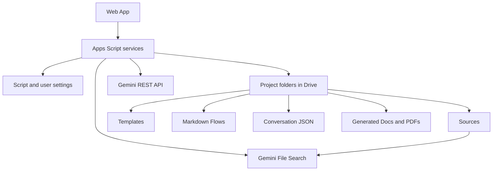

# Arquitectura técnica

Versión de referencia: 1.5.4.

## Flujo principal

## Fuentes de verdad

- `Project Manifest.json`: metadatos portátiles con la carpeta del proyecto.
- `Project Control`: registro tabular y auditable.
- Archivos JSON de conversación: historial completo, sin límites de celda.
- `Documents Index.json`: metadatos, origen y relaciones parent/child de documentos generados.
- `Templates Index.json`: formatos Google Docs, Sheets y Slides disponibles para reportes.
- `Flows Index.json`: procedimientos Markdown disponibles para consultas.
- Carpetas de Drive: permisos reales y documentos.

No existe un registro central de proyectos en propiedades del script. En cada carga se enumeran únicamente las carpetas activas que son hijas directas de la raíz y se lee su manifiesto. El manifiesto permite que una copia manual conserve su estructura; si dos carpetas activas presentan el mismo `projectId`, se genera uno nuevo para la segunda. El clonado desde la interfaz copia el árbol completo y remapea IDs de Drive, chats y relaciones documentales.

## Memoria y recuperación híbrida

La memoria no depende del estado remoto de una conversación de Gemini. Cada solicitud se construye de forma controlada con datos del proyecto:

1. instrucciones del sistema;
2. descripción del proyecto;
3. resumen acumulativo;
4. ventana reciente;
5. fragmentos semánticos recuperados desde File Search para las fuentes indexadas;
6. fragmentos locales de documentos generados o fuentes todavía no indexadas;
7. Flows seleccionados como instrucciones, separados de la evidencia;
8. consulta actual.

Cada llave personal crea su propio almacén File Search por proyecto. Los IDs del almacén y documentos remotos permanecen en `UserProperties`; el PDF, Google Sheet u otro archivo original permanece en Drive como fuente de verdad. Esta estrategia conserva el historial completo en Drive y evita que el proyecto dependa de un identificador de conversación externo.

Las fuentes locales de hasta 100 MB se cargan primero a Drive mediante una sesión reanudable en bloques de 2 MB. La transferencia posterior a File Search conserva URL, offset, etapa, inicio del intento y progreso en `UserProperties` y avanza un bloque de 8 MB por llamada, evitando que un libro grande dependa de una sola ejecución de Apps Script. File Search fragmenta con 200 tokens y 20 de superposición; antes de iniciar una carga, la app limita defensivamente el tamaño a 512 tokens. El diagnóstico reconcilia la operación de larga duración con la lista de documentos remotos asociados mediante `source_id` o `drive_id`: `failed` exige un fallo confirmado, `unknown` cubre una operación huérfana o no verificable, y `ready` exige un documento `STATE_ACTIVE`. Un reintento forzado elimina primero todos los documentos remotos de esa fuente.

## Grafo documental

Cada fuente original se representa como un nodo de nivel 0. Los documentos generados guardan una lista de `parentIds`; su nivel se calcula como uno más que el nivel máximo de sus padres. Los archivos existentes sin metadatos se registran automáticamente como documentos generados de nivel 1. Cada nodo admite una nota descriptiva persistente. La selección de nodos se guarda con cada conversación cuando se envía un mensaje y controla el contexto recuperado para Gemini.

## Aislamiento por usuario

- Configuración global de dominio y carpeta raíz: `ScriptProperties`.
- Llave y modelo de Gemini: `UserProperties`.
- Favoritos: `UserProperties`.
- Almacén File Search, estados de indexación y plantilla de reportes: `UserProperties`.
- Permisos de contenido: registro de miembros más permisos reales de Drive.

Cada función pública vuelve a validar dominio, membresía, rol y alcance antes de acceder a Drive o Gemini.
