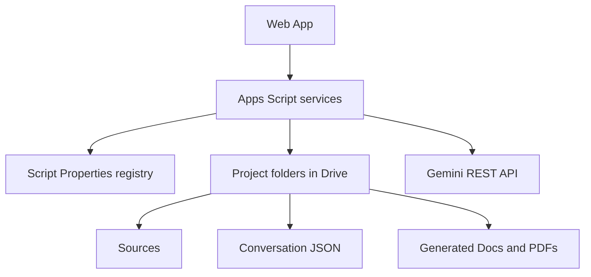

# Arquitectura técnica

## Flujo principal

## Fuentes de verdad

- `Project Manifest.json`: metadatos portátiles con la carpeta del proyecto.
- Registro en propiedades del script: índice rápido y membresías necesarias para el dashboard.
- `Project Control`: registro tabular y auditable.
- Archivos JSON de conversación: historial completo, sin límites de celda.
- Carpetas de Drive: permisos reales y documentos.

El registro central puede reconstruirse escaneando la carpeta raíz. El manifiesto permite que una copia manual conserve su estructura; si el `projectId` ya pertenece a otra carpeta, se genera uno nuevo.

## Memoria y recuperación

La memoria no depende del estado remoto de una conversación de Gemini. Cada solicitud se construye de forma controlada con datos del proyecto:

1. instrucciones del sistema;
2. descripción del proyecto;
3. resumen acumulativo;
4. ventana reciente;
5. fragmentos de fuentes con mayor coincidencia léxica;
6. archivos binarios compatibles;
7. consulta actual.

Esta estrategia conserva el historial completo en Drive y evita que el proyecto dependa de un identificador de conversación externo.

## Aislamiento por usuario

- Configuración global: `ScriptProperties`.
- Llave y modelo de Gemini: `UserProperties`.
- Favoritos: `UserProperties`.
- Permisos de contenido: registro de miembros más permisos reales de Drive.

Cada función pública vuelve a validar dominio, membresía, rol y alcance antes de acceder a Drive o Gemini.
